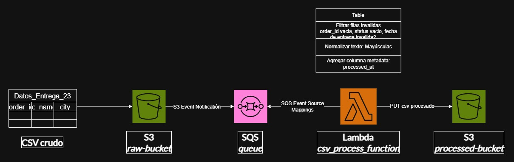

# CSV Pipeline con AWS (S3 + SQS + Lambda)

Ejercicio para construir un pipeline impulsado por eventos de procesamiento y almacenamiento de archivos CSV para su posterior análisis, utilizando los servicios de S3, SQS y Lambda

## Arquitectura

## Stack
- Python 3.14
- Boto3
- AWS CLI
- Floci (Emulador local de AWS)

